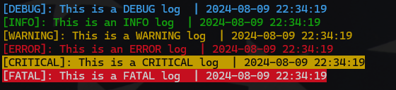
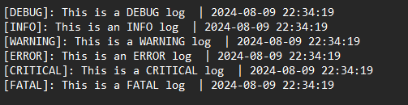

<h1 align="center"> Logger Library </h1>

This is a simple logger that I made to simplify and also store the debugging information that might be critical in the future.
You can use this library whether for only console logging or save those logging into custom file

> [!NOTE]
> NEW UPDATE: Logger is capable of logging every type of data

<h2>Guide</h2>

 <h3> make an instance: </h3>
   
```CPP
#include "Logger.h"
int main(){

Logger* log = Logger::initLogger();

}
```

<h3>To log into console only: </h3> 

```CPP
#include "Logger.h"

int main(){

Logger* log = Logger::initLogger();

log->Log(LogLevel::ERROR, "This is an error log") 
}
```
<h3>To start and stop logging into a file: </h3>

```CPP

int main() {

//make an instance
	Logger* log = Logger::initLogger();

	log->setLoggingStatus(true); //start logging into the file

	log->Log(LogLevel::ERROR, "This is an error log"); //default filename is Log.log

	log->setLoggingStatus(false); //Stop logging into the file
}
```
<h3>To log in a file with a custom file name:</h3>

```CPP
int main() {

//make an instance
	Logger* log = Logger::initLogger();

	log->setLoggingStatus(true); //start logging into the file

	log->setLoggingFilename("Logging"); // add your custom name for log file

	log->Log(LogLevel::ERROR, "This is an error log"); //start logging into Logging.log

	log->setLoggingStatus(false); //Stop logging into the file
}
```


<h3>All the LogLevels : </h3>

```CPP
enum class LogLevel {
	DEBUG,
	INFO,
	WARNING,
	ERROR,
	CRITICAL,
	FATAL
};
```

<h2 align="center">Screenshots</h2>

 <h3> Loggin into the console </h3>
 


 <h3> Loggin into a file </h3>
 



