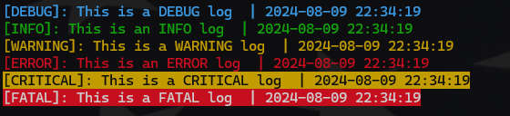
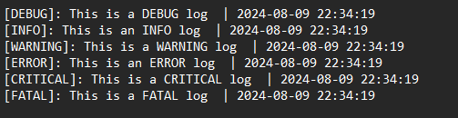

<h1 align="center"> Logger Library </h1>


This is a simple logging library that is made to colorize errors and info based on their levels. It'll allow you to store the information with their levels and time occurance inside a file with a custome name.


> [!NOTE]
> NEW UPDATE: The structure has been changed, read the doc for further information.

> [!NOTE]
> NOTE: Thread Safety is added

<h2>Guide</h2>

 <h3>Making An Instance: </h3>
   
```CPP
#include "SyncLogging.h"
int main(){

SyncLogging logger;

}
```

<h3>Printing Information Only In The Console: </h3> 

```CPP
#include "SyncLogging.h"

int main(){

SyncLogging logger;

logger.Log(LogLevel::ERROR, "This is an error log") 
}
```
<h3>Start / Stop Storing Information In A File: </h3>

```CPP

int main() {

//make an instance
	SyncLogging logger;

	logger.enableFileLogging(true); //start logging into the file

	logger.Log(LogLevel::ERROR, "This is an error log"); //default filename is Log.log

	logger.enableFileLogging(false); //Stop logging into the file
}
```
<h3>Set A Custom File Name:</h3>

```CPP
int main() {

//make an instance
	SyncLogging logger;

	logger.setFileName("Logging"); // add your custom name for log file

	logger.enableFileLogging(true); //start logging into the file

	logger.Log(LogLevel::ERROR, "This is an error log"); 
	
	logger.enableFileLogging(false); //Stop logging into the file
}
```


<h3>Information Levels Based On Their Importance : </h3>

```CPP
enum class LogLevel {
	DEBUG,
	INFO,
	WARNING,
	ERROR,
	CRITICAL,
	FATAL
};
```

<h2 align="center">Screenshots</h2>

 <h3> Colorized Information</h3>
 


 <h3>File Structure Of Stored Data</h3>
 



